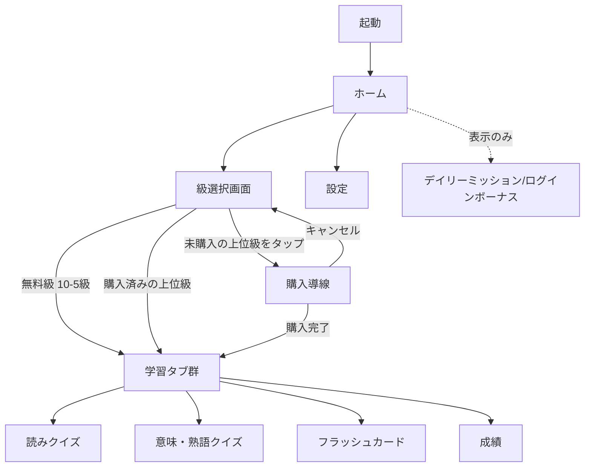
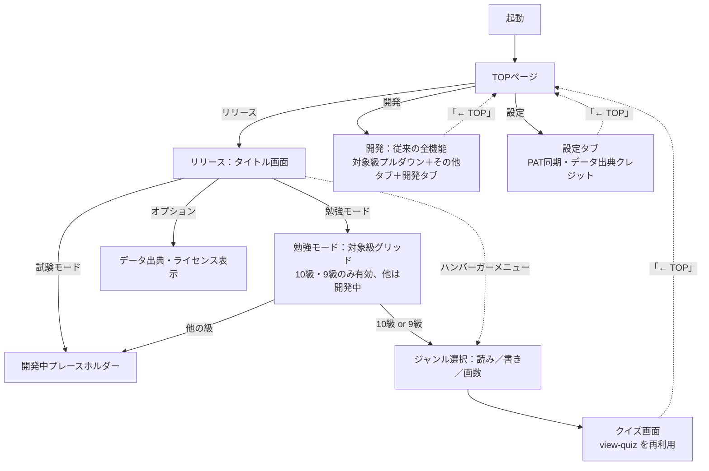

# UX設計（画面遷移・情報設計）

確認日：2026-08-29。[00_市場調査/コンセプト.md](../00_市場調査/コンセプト.md)を前提に、画面構成・機能面のUXを検討する。ビジュアル（配色・アイコン・キャラクター等）は[ビジュアルデザイン.md](./ビジュアルデザイン.md)で別途扱う。

## デザイン原則

コンセプトの「真剣に学びたい大人向け・実用性重視」と、競合調査で見えたシニア向けアプリの不満点（[00_市場調査/README.md](../00_市場調査/README.md)参照）から導く原則。

- **子供っぽい演出をしない**：キャラクター・ストーリー仕立ては入れない（コンセプト確定事項）
- **文字は大きめ・操作はシンプルに**：競合の「シニア向けボケ防止クイズ」は文字サイズ・操作の単純さが評価されていた
- **時間制限で急かさない**：同競合アプリでは「制限時間が固定で高齢者には急かされる」という不満があった。時間制限機能を入れる場合は必ず無効化・延長できるようにする
- **広告に頼らない**：競合の弱点として「広告が頻繁・しつこい」が繰り返し指摘されていた（[00_市場調査/README.md](../00_市場調査/README.md)の示唆）。今回のコンセプト上も、広告非表示を前提にした画面設計にする
- **段階的アンロックのUIをきちんと見せる**：ロックされた上位級が「どう見えて、どう解放されるか」が体験の核になる（[00_市場調査/コンセプト.md](../00_市場調査/コンセプト.md)の価格戦略仮説）

## 画面棚卸し（現状のWeb版）

`index.html`ベース。ヘッダーの学年プルダウン（すべて／1〜6年）＋6タブ構成。

| 画面 | 現状の内容 |
|---|---|
| ホーム | サマリーカードのみ（`#home-summary`） |
| 読みクイズ | 例文中の熟語をハイライトして読みを4択（小1のみ対応） |
| 意味・熟語クイズ | 意味当て／熟語の空欄補充（小1のみ対応） |
| フラッシュカード | 最大20枚、自己採点（もう一度／覚えた） |
| 成績 | 学年内の正答率サマリ＋苦手漢字リスト |
| 設定 | GitHub Personal Access Token入力→読み込み／保存 |

## 新たに必要になる画面・要素

コンセプト（10級〜1級を1本のアプリで、段階的アンロックあり）を踏まえると、以下が新規または大幅な作り直しになる。

### 1. 級選択画面（新規）

現状のヘッダー内プルダウン（学年1〜6のみ）では、10級〜1級の12段階＋購入状態の表現ができない。プルダウンではなく**一覧・グリッド形式の「級選択画面」**を新設し、以下を表現する：

- 無料級（10〜5級、小学校配当漢字相当）：通常表示、タップで選択
- 未購入の上位級（4級〜1級）：ロックアイコン＋タップで購入導線（モーダル or 専用画面）
- 購入済みの上位級：通常表示

### 2. 購入導線（新規）

ロックされた級をタップした際の遷移。[00_市場調査/コンセプト.md](../00_市場調査/コンセプト.md)の価格モデルが未確定なため、UI側も以下が未定：

- 級ごとの個別購入か、まとめ買いかで画面構成が変わる（個別なら級選択画面からモーダル、まとめ買いなら専用の購入画面が要る）
- → [00_市場調査](../00_市場調査/コンセプト.md)の「アンロックの単位」が決まってから確定する

### 3. モチベーション機能（新規）

ログインボーナス・デイリーミッション（コンセプト確定事項）をホーム画面に表示する想定。既存の「summary-card」を拡張するか、専用のカードを追加するかは要検討。

### 4. 既存4タブ（読み／意味熟語／フラッシュカード／成績）

構成自体は級選択後の下位階層としてほぼ流用できそう。ただし対象データが小1〜6の1,006字から将来的に約7,000字規模（1,026字＋準1級・1級分）に広がるため、[00_市場調査/機能比較.md](../00_市場調査/機能比較.md)で見た「対義語・類義語」「四字熟語」「故事・諺」等の新ジャンルをどのタブに追加するか、それとも新規タブを作るかは未定

## 画面遷移図（案）

## 【2026-09-03決定】初回リリースはiOS/Androidストアへ直接、全級無料・ローカル保存のみ

ユーザー判断により以下を決定した（[00_市場調査/収益予測.md](../00_市場調査/収益予測.md)・[05_リリース_ストア申請/README.md](../05_リリース_ストア申請/README.md)にも反映）：

- **リリース先**：Web版を経由せず、iOS/Androidストアへ直接申請する（[01_技術調査](../01_技術調査/README.md)のCapacitor方針に沿う）
- **初回スコープ**：段階的アンロック（課金）・GitHub PATによる進捗クラウド同期は両方とも見送り、進捗は**LocalStorageのみ**で保持する。これにより下記の「設定画面のGitHub PAT認証」ブロッカーは実質解消（一般ユーザーにPAT入力を求める画面自体を配布物から外せばよい）
- **対象級（2026-09-03、さらに絞り込み）**：全級（10級〜1級）ではなく、**初回は10級・9級・8級の3級のみを無料公開**する。この範囲の7ジャンル（漢字の読み／書取／筆順・画数／部首・部首名／送り仮名／対義語／同じ漢字の読み）は実装・データとも完成済み（[05_リリース_ストア申請/README.md](../05_リリース_ストア申請/README.md)参照）。7級以上は実装済みだが今回は非公開にし、リリース後のアップデートで段階的に解禁する
- **後回しにする機能**（リリース後のアップデートで検討）：7級以上の級の解禁、段階的アンロック・課金導線、進捗のクラウド同期（機種変更時の引き継ぎ）、モチベーション機能（ログインボーナス等）
- この決定に伴い、**配布物（ストア提出ビルド）からは「設定」タブのGitHub PAT入力欄と「開発」タブ（開発者専用、コードリポジトリへの書き込み権限を要求する）の両方を除外する必要がある**（[CLAUDE.md](../CLAUDE.md)冒頭で「配布物からは分離していない」と既知の制約として記載されていた点の対応。[01_技術調査](../01_技術調査/README.md)のCapacitor移行作業と合わせて対応）

## 【解消済み】設定画面のGitHub PAT認証は一般ユーザー向けに成立しない

現状の「設定」画面は、**GitHub Personal Access Tokenをユーザー自身に発行・入力させる**方式（[CLAUDE.md](../CLAUDE.md)の「3. 学習進捗データの通信ルール」参照）。これは開発者本人が使うSecond Brain方式のツールとしては妥当だが、**ストアで不特定多数（特に「老後の学びなおし世代」というITに詳しくない可能性のある層）に販売するアプリとしては、UX的にもストア審査的にも成立しない**。

- GitHub Personal Access Tokenの発行は、GitHubアカウント作成・開発者向け設定画面の操作が必要で、一般ユーザーには大きすぎるハードル
- App Store／Google Playの審査ガイドライン上も、一般消費者向けアプリで開発者向け認証情報の入力を求める設計は不自然に見える可能性がある

**採用案（2026-09-03決定）**：当面はクラウド同期なし・ローカルのみでリリースし、同期機能（アカウント機能＋自前バックエンド、または他の方式）は後続バージョンで検討する。

## 【staleness注記】上記の画面棚卸し・遷移図は2026-08-29時点のもの（2026-09-14に現状へ更新済み）

上記「画面棚卸し」（学年プルダウン＋6タブ構成）・「画面遷移図（案）」（級選択画面を新設する案）は2026-08-29時点の草案。その後の実装で段階的に刷新され、2026-09-13にTOPページ・リリースフローが新設されたことで、当初この案が目指していた「級選択画面」も別の形（後述）で実現した。以下、2026-09-14時点の実際の画面構成に更新する。

## 現状の画面構成（2026-09-14更新、実装ベース）

`index.html`／`js/app.js`（`state.rootView`）を見て記載。詳細は[README.md](../README.md)「TOPページ（画面構成）」・[CLAUDE.md](../CLAUDE.md)「4. 実装の心得」参照。

**級選択画面について**：2026-08-29時点の案（「無料級／未購入の上位級（ロック）／購入済みの上位級」の3状態を1つのグリッドで見せる）は、段階的アンロック自体を初回リリース対象外にしたため不要になった。代わりに2026-09-13、リリースフローの「勉強モード」内に**対象級グリッド**（`view-release-study-kyu`）を新設した。ただし現状は「購入」概念が無く、単純に「`RELEASE_KYU_LIST`（今回は10級・9級）＝有効／それ以外＝（開発中）」の2状態のみ（当初案の「ロック＋購入導線」は将来、課金モデルを正式決定した際に必要になる）。

## 対象範囲（トライアルで触る画面／後回しにする画面、2026-09-14整理）

**トライアルで触る画面**（実装・調整対象）：
- TOPページ、リリースフローの「タイトル→勉強モード→対象級選択（10級・9級）→ジャンル選択→クイズ（読み・書き・画数）」の一連、および「オプション」（データ出典表示）、ハンバーガーメニュー
- 上記が依存する既存の`view-quiz`（読み・書取・筆順画数クイズ本体）

**今回のトライアルでは触らない・後回しにする画面**：
- リリースフローの「試験モード」：開発中プレースホルダーのまま（myself/TODO.md（別リポジトリ、kanziセクション）項目1「今回のトライアル向け最低ライン」で見送り済み）
- 「開発」ボタン配下の全画面（対象級プルダウンでの8級以上のクイズ・ホーム・意味熟語クイズ・フラッシュカード・成績・開発タブ）：これらはエンドユーザー向けの配布物には含まれない開発者専用ツール（`RELEASE_BUILD`で除外予定）であり、UI調整の対象外
- 出題テンポ調整・振り返り（復習）機能・書き取りのテキスト入力化・総画数問題：myself/TODO.md（別リポジトリ、kanziセクション）項目1-1〜1-4/1-5で既にリリース後アップデート送りと決定済み（本ドキュメントで重複決定はしない）
- モチベーション機能（ログインボーナス・デイリーミッション）・段階的アンロックのUI：[00_市場調査/コンセプト.md](../00_市場調査/コンセプト.md)の価格モデルが未確定のため、正式決定まで着手しない

## 未定事項

- [x] ~~購入導線の画面構成~~ → 初回リリースでは段階的アンロックを見送るため当面不要（2026-09-03）
- [x] 新ジャンル（対義語類義語・四字熟語・故事諺等）をタブ追加するか既存タブ内に統合するか → 実装済み。「クイズ」タブ内のジャンルサブタブとして統合（[README.md](../README.md)参照）
- [x] ~~設定画面のデータ同期方式（GitHub PAT問題）の代替案決定~~ → 解消済み（上記2026-09-03決定）

残るTODO（モチベーション機能の見せ方）はmyself/TODO.md（別リポジトリ）に集約済み。

## ステータス

- [x] 既存画面の棚卸し（2026-08-29時点の草案、2026-09-14に現状の実装へ更新）
- [x] 新規に必要な画面・要素の洗い出し
- [x] 画面遷移図の更新（2026-09-14、TOPページ・リリースフローを反映）
- [x] データ同期方式の問題点を検出・記録 → 2026-09-03、ローカル保存のみで初回リリースする方針を決定し解消
- [x] 段階的アンロックは初回リリース対象外と決定（2026-09-03）。詳細設計は見送り
- [x] **（2026-09-14追加）02_デザインとのすり合わせ・対象範囲の洗い出し**：本ドキュメントを実装に合わせて更新し、トライアルで触る画面／後回しにする画面を明文化した（myself/TODO.md（別リポジトリ、kanziセクション）項目2の残り2件に対応）
