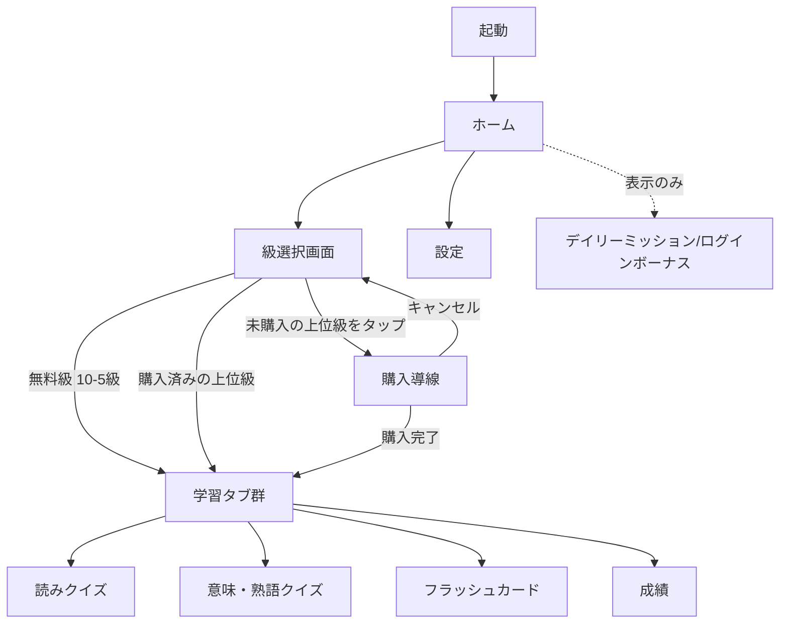

# UX設計（画面遷移・情報設計）

確認日：2026-08-29。[00_市場調査/コンセプト.md](../00_市場調査/コンセプト.md)を前提に、画面構成・機能面のUXを検討する。ビジュアル（配色・アイコン・キャラクター等）は[ビジュアルデザイン.md](./ビジュアルデザイン.md)で別途扱う。

## デザイン原則

コンセプトの「真剣に学びたい大人向け・実用性重視」と、競合調査で見えたシニア向けアプリの不満点（[00_市場調査/README.md](../00_市場調査/README.md)参照）から導く原則。

- **子供っぽい演出をしない**：キャラクター・ストーリー仕立ては入れない（コンセプト確定事項）
- **文字は大きめ・操作はシンプルに**：競合の「シニア向けボケ防止クイズ」は文字サイズ・操作の単純さが評価されていた
- **時間制限で急かさない**：同競合アプリでは「制限時間が固定で高齢者には急かされる」という不満があった。時間制限機能を入れる場合は必ず無効化・延長できるようにする
- **広告に頼らない**：競合の弱点として「広告が頻繁・しつこい」が繰り返し指摘されていた（[00_市場調査/README.md](../00_市場調査/README.md)の示唆）。今回のコンセプト上も、広告非表示を前提にした画面設計にする
- **段階的アンロックのUIをきちんと見せる**：ロックされた上位級が「どう見えて、どう解放されるか」が体験の核になる（[00_市場調査/コンセプト.md](../00_市場調査/コンセプト.md)の価格戦略仮説）

## 画面棚卸し（現状のWeb版）

`index.html`ベース。ヘッダーの学年プルダウン（すべて／1〜6年）＋6タブ構成。

| 画面 | 現状の内容 |
|---|---|
| ホーム | サマリーカードのみ（`#home-summary`） |
| 読みクイズ | 例文中の熟語をハイライトして読みを4択（小1のみ対応） |
| 意味・熟語クイズ | 意味当て／熟語の空欄補充（小1のみ対応） |
| フラッシュカード | 最大20枚、自己採点（もう一度／覚えた） |
| 成績 | 学年内の正答率サマリ＋苦手漢字リスト |
| 設定 | GitHub Personal Access Token入力→読み込み／保存 |

## 新たに必要になる画面・要素

コンセプト（10級〜1級を1本のアプリで、段階的アンロックあり）を踏まえると、以下が新規または大幅な作り直しになる。

### 1. 級選択画面（新規）

現状のヘッダー内プルダウン（学年1〜6のみ）では、10級〜1級の12段階＋購入状態の表現ができない。プルダウンではなく**一覧・グリッド形式の「級選択画面」**を新設し、以下を表現する：

- 無料級（10〜5級、小学校配当漢字相当）：通常表示、タップで選択
- 未購入の上位級（4級〜1級）：ロックアイコン＋タップで購入導線（モーダル or 専用画面）
- 購入済みの上位級：通常表示

### 2. 購入導線（新規）

ロックされた級をタップした際の遷移。[00_市場調査/コンセプト.md](../00_市場調査/コンセプト.md)の価格モデルが未確定なため、UI側も以下が未定：

- 級ごとの個別購入か、まとめ買いかで画面構成が変わる（個別なら級選択画面からモーダル、まとめ買いなら専用の購入画面が要る）
- → [00_市場調査](../00_市場調査/コンセプト.md)の「アンロックの単位」が決まってから確定する

### 3. モチベーション機能（新規）

ログインボーナス・デイリーミッション（コンセプト確定事項）をホーム画面に表示する想定。既存の「summary-card」を拡張するか、専用のカードを追加するかは要検討。

### 4. 既存4タブ（読み／意味熟語／フラッシュカード／成績）

構成自体は級選択後の下位階層としてほぼ流用できそう。ただし対象データが小1〜6の1,006字から将来的に約7,000字規模（1,026字＋準1級・1級分）に広がるため、[00_市場調査/機能比較.md](../00_市場調査/機能比較.md)で見た「対義語・類義語」「四字熟語」「故事・諺」等の新ジャンルをどのタブに追加するか、それとも新規タブを作るかは未定

## 画面遷移図（案）

## 【要検討・ブロッカー】設定画面のGitHub PAT認証は一般ユーザー向けに成立しない

現状の「設定」画面は、**GitHub Personal Access Tokenをユーザー自身に発行・入力させる**方式（[CLAUDE.md](../CLAUDE.md)の「3. 学習進捗データの通信ルール」参照）。これは開発者本人が使うSecond Brain方式のツールとしては妥当だが、**ストアで不特定多数（特に「老後の学びなおし世代」というITに詳しくない可能性のある層）に販売するアプリとしては、UX的にもストア審査的にも成立しない**。

- GitHub Personal Access Tokenの発行は、GitHubアカウント作成・開発者向け設定画面の操作が必要で、一般ユーザーには大きすぎるハードル
- App Store／Google Playの審査ガイドライン上も、一般消費者向けアプリで開発者向け認証情報の入力を求める設計は不自然に見える可能性がある

**代替案（未検討・要相談）**：

- ローカル保存のみにして進捗のクラウド同期自体をやめる（最も単純だが「機種変更時に進捗が消える」問題が残る）
- 通常のアカウント機能（メール／Apple・Googleサインイン等）＋自前のバックエンド（GitHub APIの代わり）を新設する（開発規模が大きくなる）
- 当面はクラウド同期なし・ローカルのみでリリースし、同期機能は後続バージョンで検討する

この論点は[01_技術調査](../01_技術調査/README.md)のバックエンド方針とも直結するため、UX設計を先に進める前に一度方向性を相談したい。

## 未定事項

- [ ] 級選択画面のレイアウト（グリッドか縦リストか）
- [ ] 購入導線の画面構成（[00_市場調査](../00_市場調査/コンセプト.md)のアンロック単位が決まってから）
- [ ] モチベーション機能（ログインボーナス・デイリーミッション）の具体的な見せ方
- [ ] 新ジャンル（対義語類義語・四字熟語・故事諺等）をタブ追加するか既存タブ内に統合するか
- [ ] **設定画面のデータ同期方式（GitHub PAT問題）の代替案決定（要相談）**

## ステータス

- [x] 既存画面の棚卸し
- [x] 新規に必要な画面・要素の洗い出し
- [x] 画面遷移図（案）の作成
- [x] データ同期方式の問題点を検出・記録（要相談としてブロッカー化）
- [ ] 級選択画面・購入導線の詳細設計（アンロック単位確定後）
